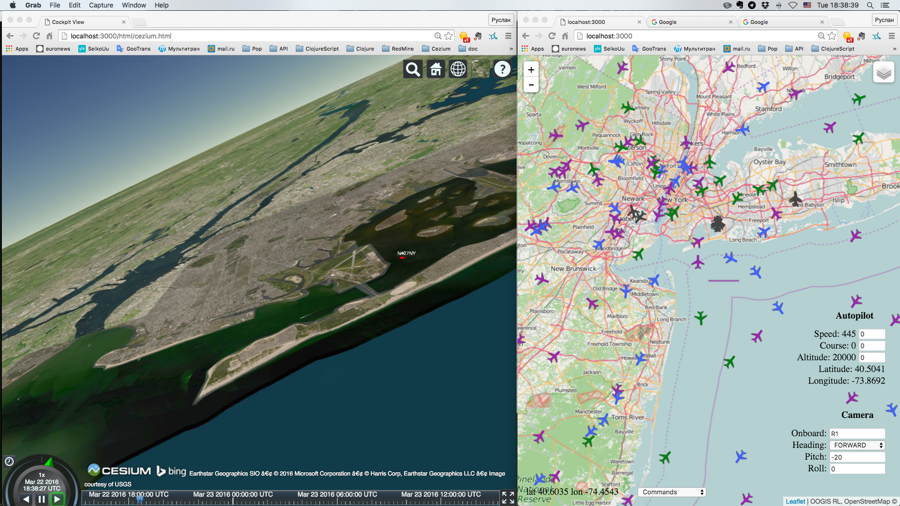

# rete4flights

Air traffic control system and flight simulator - a test example for the [rete4frames] (http://github.com/rururu/rete4frames) expert system shell.
It uses [Flightradar24] (http://www.flightradar24.com) web service, [Leaflet] (http://leafletjs.com) JavaScript library, [Cesium] (https://cesiumjs.org/) WebGL virtual globe and map engine and [geonames] (http://www.geonames.org) geographical database.


## Start

1. Simple start:
```
$ cd <..>/rete4flights
$ lein run
```
2. Start for developers with automatic start of a browser client:
```
$ cd <..>/rete4flights
$ lein repl
...
rete4flight.core=> (-main)
```
3. Start for developers for hand start of a browser client:
```
$ cd <..>/rete4flights
$ lein repl
...
rete4flight.core=> (start-server)
```
And open address http://localhost:3000 in a browser.

## Usage

First select in a "Commands" selector an item "Watch visible area". Then select an item "State of flights". This begins a process of collection and display information of flights in the visible area. Black icons means aircrafts on the ground, green ones are descending, blue ones are climbing and purple - on a level flight.

A command "Intersection" calculates aircrafts that intersect in 6 minutes on a distance less then 400 meters (altitude differense less than 10000 feet). If you click on a link between aircrafts you know accurate values.

Click on an aircraft icon brings up a popup with general data of a flight and 3 buttons. A button "Trail" draws a current way of the aircraft. A button "Follow" starts moving of the visible area along this flight and periodically displays a trail of the flight. A button "Stop" ends up this moving.

Using a command "Move to Airport" you can instantly shift to some other airport. First select a country and then an airport in this country.

You can plan your own flights. To do this, use a command "Schedule Flight". Input a call sign of your flight, time of departure, select a country and an airport of departure and a country and an airport of arrival. That's all. When your flight starts you can follow it.

A command "Camera"  allows you to be in a cockpit of the aircraft and enjoy a view from the cockpit, experience exciting feeling of landing, available only to pilots. To get on board of aircraft just select its callsign in a dropdown box "onboard" and open a second browser window on the address "http://localhost:3000/html/cezium.html". If you have powerful hardware and want to fly in mountains try this address: "http://localhost:3000/html/terrain3D.html". To update the dropdown box close the page of the camera view, switch off and switch on the camera and reopen camera page.

You can see other flights from the cockpit. Other flights displayed with blue or red icons and call signs. Blue flights are following with yours, red ones are opposite.

You can fly yourself using a command "Manual Control". Start a new flight, climb on board and switch to the manual control. Now you can input in the autopilot new values of speed, course and altitude and it execute these directives in accordance with programmed dynamics (you can change it as you like). Naturally, you can't control real flights.

Alternatively, you can start your flight at any point by a similar sequence of commands in the REPL:
```
rete4flight.core=> (add-my-flight "R1" [40.9177 -74.7949] 45 230 15000)
"-1"
rete4flight.core=> (plane-move "-1" 1)
```



Enjoy flying.

You can get information about interesting things along the route from Wikipedia automatically. Just click a command "wikipedia".


Expert system handling this process is in the file es.clj.

If you want to use this application on a regular basis, please get your own Bing Maps Api key and update its value in a "resources/html/cesium.html" and a "resources/html/terrain3D.html" file. Do the same for the geonames username in a "src/clj/rete4flight/data.clj" file.

Copyright and license
----

Copyright © 2016 Ruslan Sorokin.

Licensed under the EPL (see the file epl.html).
# rete4flights
